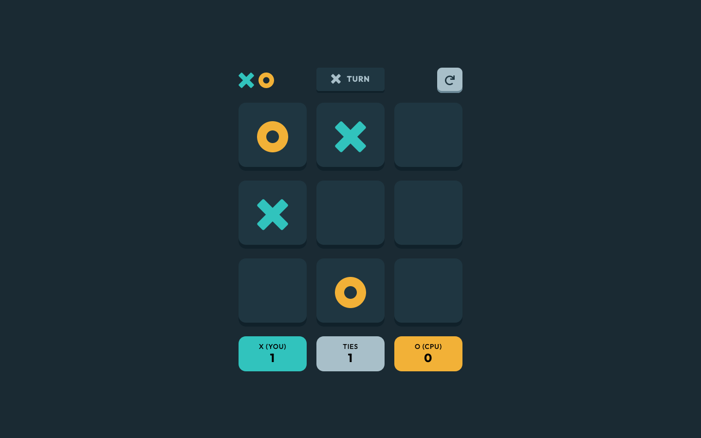
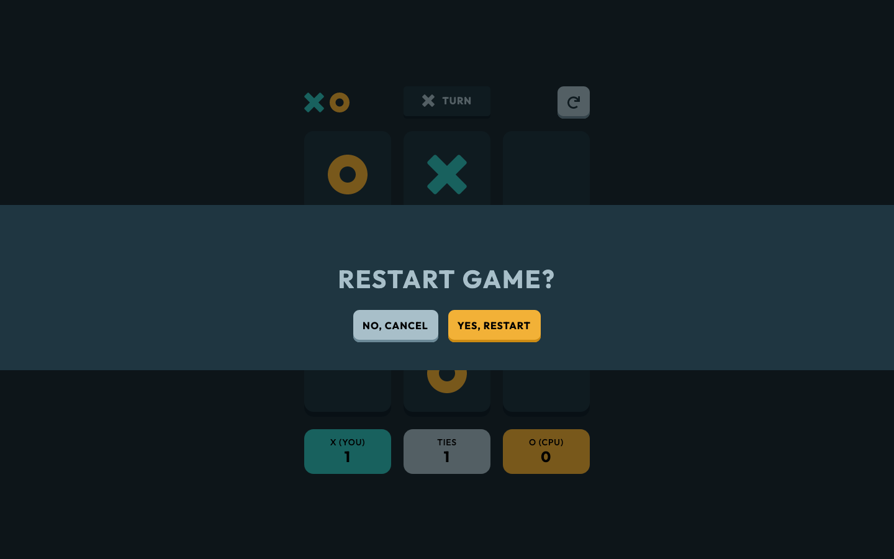

# Frontend Mentor - Tic Tac Toe solution

This is a solution to the [Tic Tac Toe challenge on Frontend Mentor](https://www.frontendmentor.io/challenges/tic-tac-toe-game-Re7ZF_E2v). Frontend Mentor challenges help you improve your coding skills by building realistic projects.

## Table of contents

- [Overview](#overview)
  - [The challenge](#the-challenge)
  - [Screenshot](#screenshot)
  - [Links](#links)
- [My process](#my-process)
  - [Built with](#built-with)
  - [What I learned](#what-i-learned)
  - [Continued development](#continued-development)
  - [Useful resources](#useful-resources)
- [Author](#author)

## Overview

### The challenge

Users should be able to:

- View the optimal layout for the game depending on their device's screen size
- See hover states for all interactive elements on the page
- Play the game either solo vs the computer or multiplayer against another person
- **Bonus 1**: Save the game state in the browser so that it’s preserved if the player refreshes their browser
- **Bonus 2**: Instead of having the computer randomly make their moves, try making it clever so it’s proactive in blocking your moves and trying to win

### Screenshot

### Links

- Solution URL: [Frontend Mentor](https://www.frontendmentor.io/solutions/mobilefirst-design-react-and-scss-strategic-but-imperfectcpu-player-TIp5t5mq45)
- Live Site URL: [GitHub](https://anglicus.github.io/fem_tic-tac-toe/)

## My process

### Built with

- Semantic HTML5 markup
- Flexbox
- CSS Grid
- Mobile-first workflow
- [React](https://reactjs.org/) - JS library
- SASS

### What I learned

I learned a lot about using React in this project. Before this, I had used React to build a simple hangman game and a pomodoro clock. I feel like after completing this project, I'm finally starting to get the hang of React.

Also, this was the first time I really developed a project using Git. Before I had simply uploaded my code to GitHub when I was finished, but this time around I linked to the repository from the start and made incremental commits. I found it very nice, as a couple times I decided my progress wasn't going anywhere, and it was easy to revert back to a previous state.

### Continued development

I want to go deeper into learning React and also learn more about backend development.

### Useful resources

- [Digital Ocean](https://www.digitalocean.com/community/tutorials/react-modal-component) - This article gave me some good ideas on how to implement the modal opening and closing using React.
- [Anjali Sharma](https://medium.com/mobile-web-dev/how-to-build-and-deploy-a-react-app-to-github-pages-in-less-than-5-minutes-d6c4ffd30f14) - This was a great guide to deploying a React app on GitHub.

## Author

- GitHub - [@anglicus](https://github.com/anglicus)
- Frontend Mentor - [@anglicus](https://www.frontendmentor.io/profile/anglicus)
- FreeCodeCamp [@anglicus] (https://www.freecodecamp.org/anglicus)
- Codepen - [@anglicus](https://codepen.io/anglicus)
